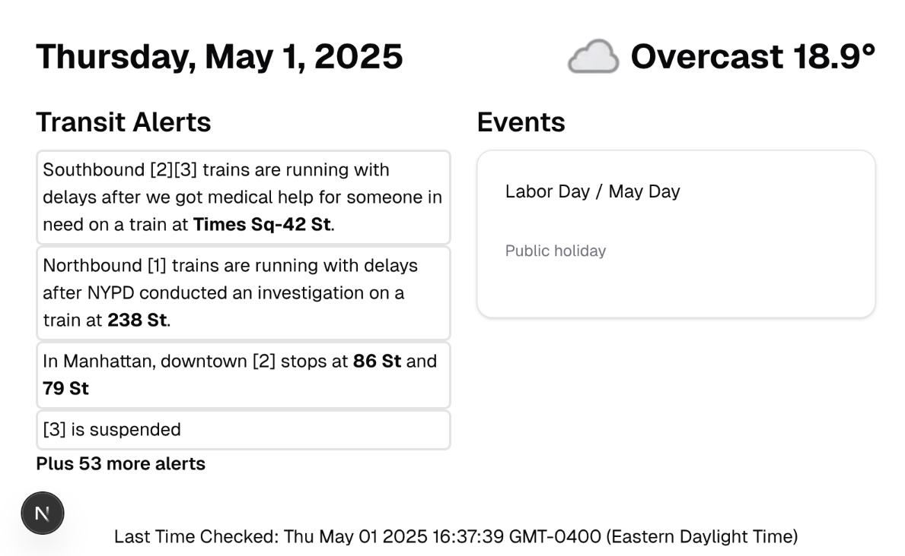

# Info Display
I have a some e-readers lying about that I would like to put to use. I discovered a program called electric sign that will take a screenshot of the page and display it as a screensaver on ereaders. I want to have it display some info from some api's, such as the weather, news, transit alerts, github requests, todos, etc. However, the ereaders I have are way out of date and can not really access the internet due ssl.

Therefore, I ended making a small web app that these ereaders can reach locally. The web app will do all the calling of the various api's.

There's no reason it can't be used by anything else or deployed on a cloud service, but the site is made to be used with http for the reason above. It shouldn't be too hard to add this after the fact.

## Sample of page:


## Getting Started

First, run the development server:

```bash
npm run dev
```

Open [http://localhost:3000](http://localhost:3000) with your browser to see the result.

This project uses [`next/font`](https://nextjs.org/docs/app/building-your-application/optimizing/fonts) to automatically optimize and load [Geist](https://vercel.com/font), a new font family for Vercel.

## Learn More


## TODO:
- Settings page to control certain pieces of info(zip code, transit lines, etc)
- Create admin page to enable or disable different connections
- Save some settings into a database(sqllite since this is an app that's meant to be run locally)
- Cache the calls for a couple of minutes

## Deploy on Vercel

The easiest way to deploy your Next.js app is to use the [Vercel Platform](https://vercel.com/new?utm_medium=default-template&filter=next.js&utm_source=create-next-app&utm_campaign=create-next-app-readme) from the creators of Next.js.

Check out our [Next.js deployment documentation](https://nextjs.org/docs/app/building-your-application/deploying) for more details.
